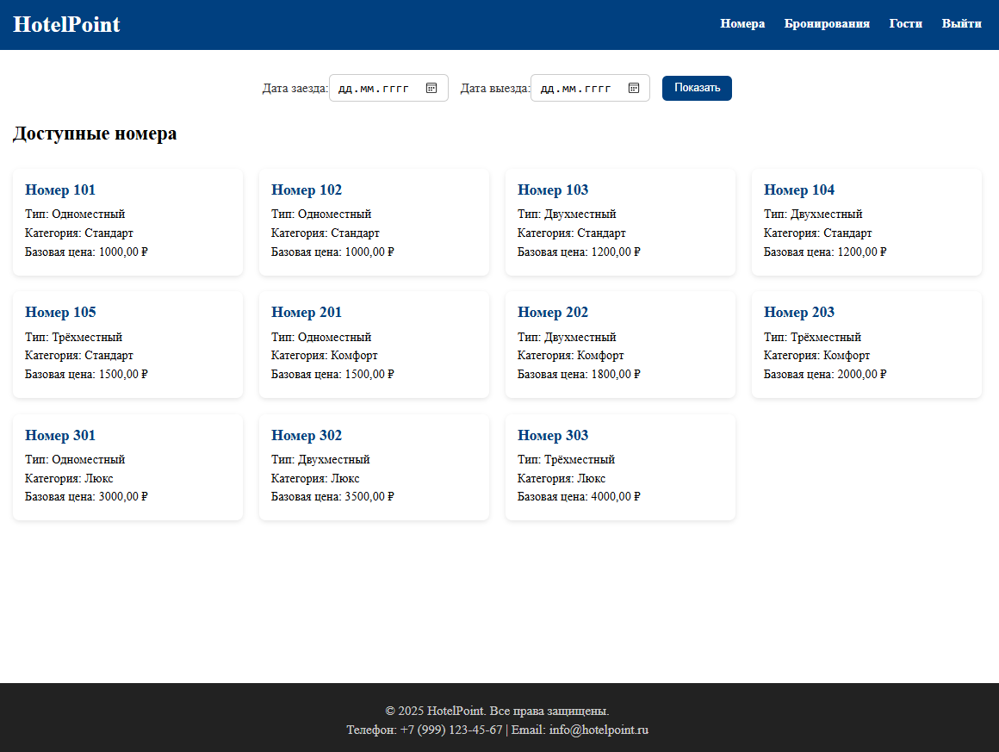
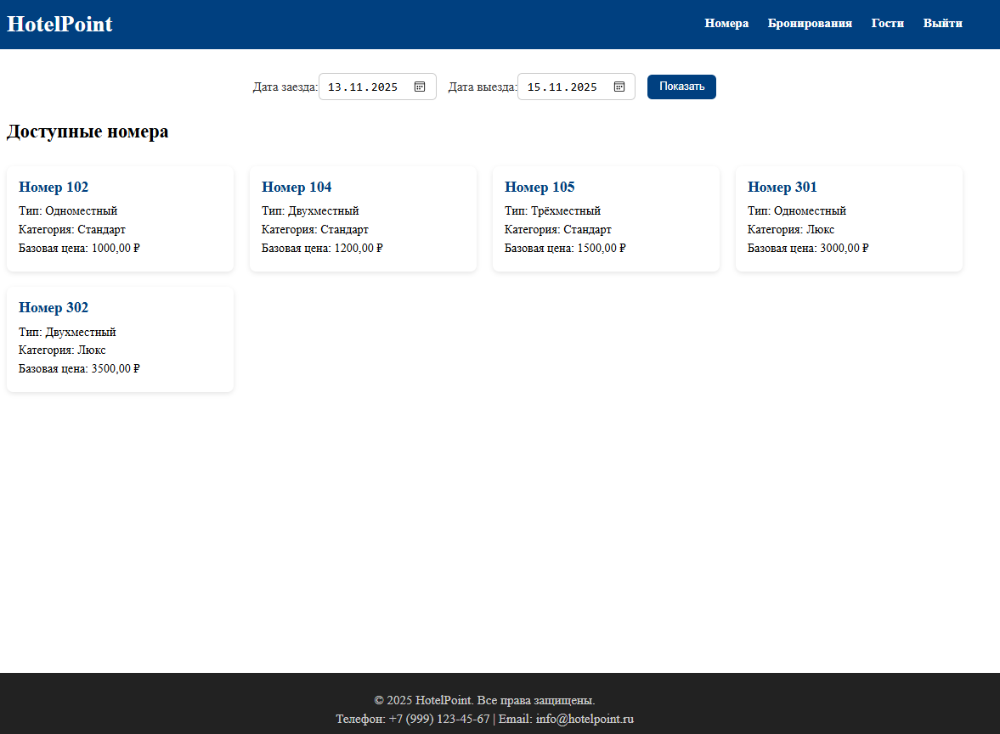
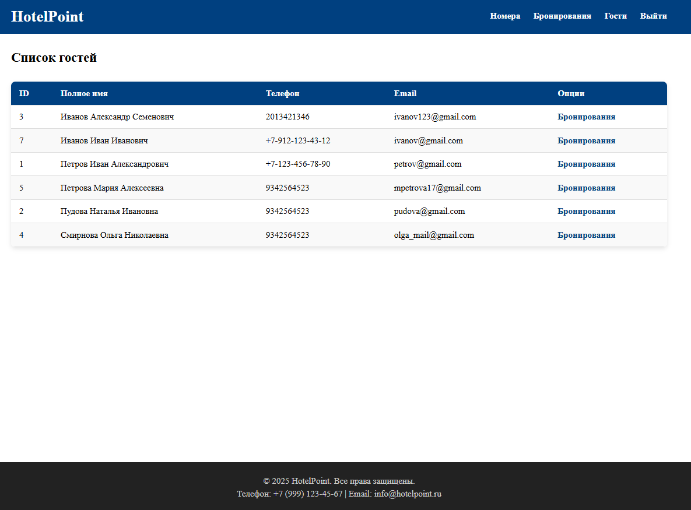
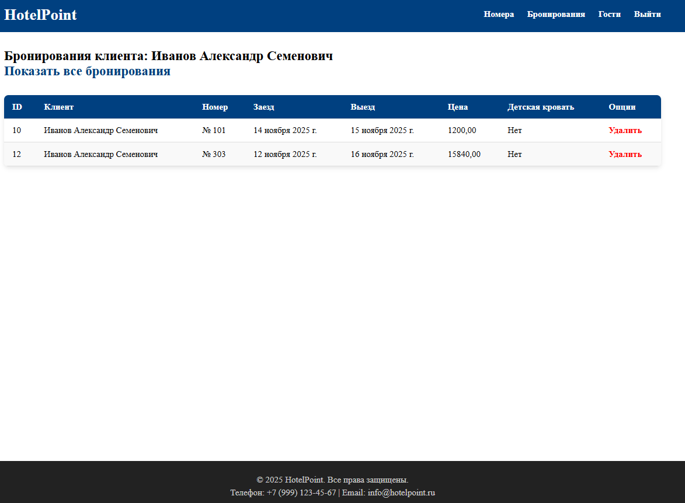
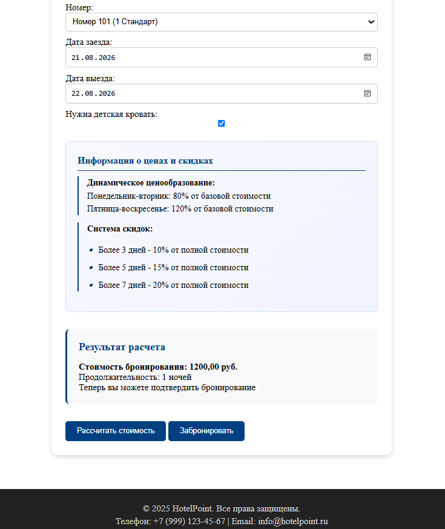
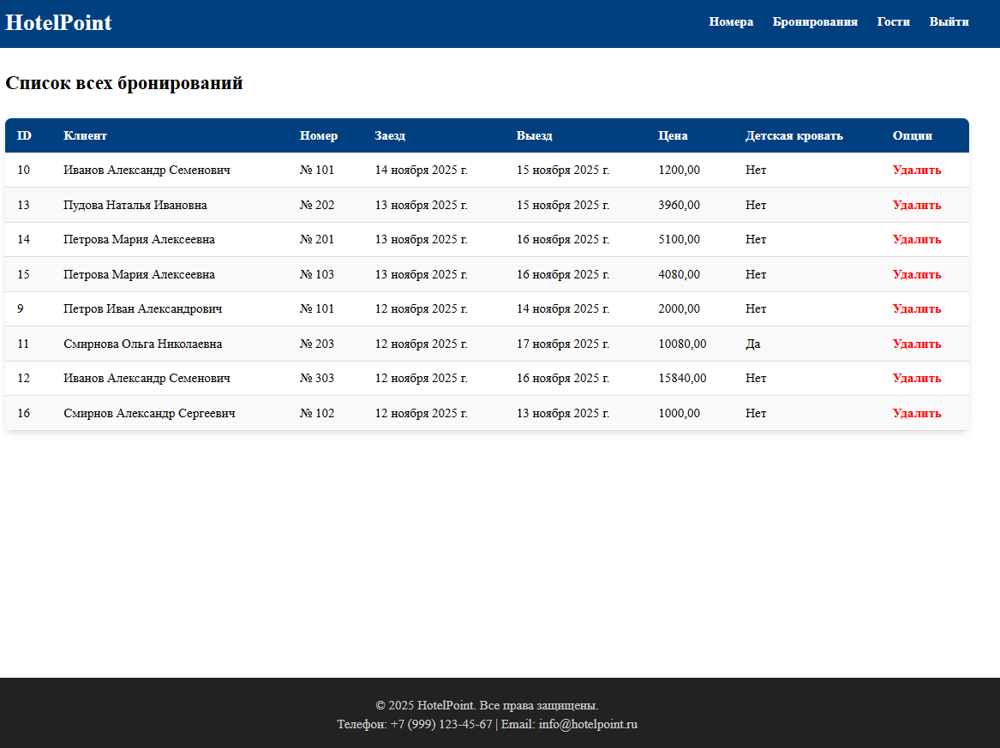

# Система управления гостиницей (HotelPoint)

Веб-приложение на Django для администраторов гостиницы, предназначенное для управления бронированиями, номерами и клиентами. Система автоматизирует расчет стоимости проживания и предоставляет удобный календарь для планирования заездов.


## Содержание
- [О проекте](#система-управления-гостиницей-(hotelpoint))
- [Скриншоты](#скриншоты)
- [Функциональность](#функциональность)
- [Установка и запуск](#установка-и-запуск)
- [Структура проекта](#структура-проекта)

## Скриншоты

<div align="center">
  <table>
    <tr>
      <td align="center">
        
        <br/>
        <b>Страница доступных номеров</b>
      </td>
      <td align="center">
        
        <br/>
        <b>Страница доступных номеров по выбранной дате</b>
      </td>
    </tr>
    <tr>
      <td align="center">
        
        <br/>
        <b>Страница постояльцев гостиницы</b>
      </td>
      <td align="center">
        
        <br/>
        <b>Страница бронирований постояльцев</b>
      </td>
    </tr>
    <tr>
      <td align="center">
        
        <br/>
        <b>Расчет стоимости при бронировании</b>
      </td>
      <td align="center">
        
        <br/>
        <b>Страница бронирований</b>
      </td>
    </tr>
  </table>
</div>

## Функциональность

* Авторизация: только для сотрудников гостиницы.
* Управление номерами: просмотр всех доступных номеров с фильтрацией по датам с помощью встроенного календаря.
* Управление клиентами: просмотр списка клиентов и их контактной информации? а также переход к странице бронирований гостя.
* Управление бронями:
  * создание бронирования: заполнение формы создания брони, выбор дат и дополнительных опций.
  * автоматический расчет итоговой стоимости на основе количества ночей и выбранных опций с учетом скидок.
  * просмотр всех броней и броней конкретного клиента.

## Стек технологий

* **Бэкенд:** Django (Python)
* **База данных:** SQLite
* **Frontend:** HTML, CSS

## Установка и запуск

1. Клонирование репозитория
```bash
git clone https://github.com/AlexanderSh11/hotelpoint.git
```
2. Создание и активация виртуального окружения
```bash
python -m venv .venv
source .venv/bin/activate  # Linux/Mac
.venv\Scripts\activate     # Windows
```
3. Установка зависимостей
```bash
pip install -r requirements.txt
```
4. Настройка базы данных  
В проекте используется SQLite, но можно создать базу данных PostgreSQL и настроить подключение в settings.py.  
Создайте файл .env на основе .env-example
6. Миграции
```bash
python manage.py migrate
```
6. Запуск сервера
```bash
python manage.py runserver
```

## Структура проекта

├── hotelpoint_project/  
│   ├── booking/                  # Приложение управления бронированиями  
│   │   ├── models.py             # Модель Booking с кодом расчета стоимости  
│   |   ├── forms.py              # Форма создания бронирования BookingForm   
│   │   └── views.py              # Представления  
│   ├── clients/                  # Приложение управления клиентами  
│   │   ├── models.py             # Модель Client   
│   │   └── views.py              # Представления  
│   ├── hotelpoint_project/       # Основное приложение проекта  
│   │   └── settings.py           # Настройки проекта  
│   ├── rooms/                    # Приложение управления номерами гостиницы  
│   │   ├── models.py             # Модели Room, RoomPrice, RoomCategory   
│   │   └── views.py              # Представления  
│   ├── users/                    # Приложение управления пользователями  
│   │   ├── models.py             # Модели UserManager, User   
│   │   └── views.py              # Представления  
│   ├── templates/                # HTML-шаблоны  
│   └── manage.py                 # Django управляющий скрипт  
├── .env                          # Переменные окружения проекта  
└── requirements.txt              # Зависимости проекта  
